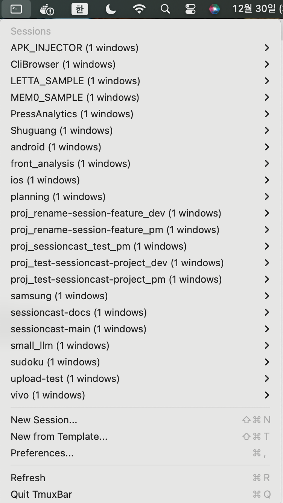

# TmuxBar

A native macOS menu bar application for managing tmux sessions.



## Features

- **Session Management**: View, create, rename, and kill tmux sessions from your menu bar
- **Session Preview**: See live terminal output before attaching
- **Session Templates**: Quick-start with pre-configured layouts (Development, Web Dev, Monitoring, SSH, Docker)
- **Favorites & Groups**: Organize sessions with favorites and custom groups
- **Multi-Terminal Support**: Works with Terminal.app, iTerm2, Alacritty, Warp, and Kitty
- **Global Hotkeys**: Quick access with keyboard shortcuts
- **Auto-refresh**: Real-time session status updates

## Installation

### Download DMG

1. Download the latest `TmuxBar-x.x.x.dmg` from [Releases](https://github.com/devload/TmuxBar/releases)
2. Open the DMG and drag TmuxBar to Applications
3. **First launch**: Right-click the app → **Open** (required to bypass Gatekeeper since the app is not code-signed)

### Build from Source

Requires macOS 13.0+ and Xcode Command Line Tools.

```bash
git clone https://github.com/devload/TmuxBar.git
cd TmuxBar/mac
swift build -c release
cp -r .build/release/TmuxBar /Applications/
```

## Usage

### Keyboard Shortcuts

| Shortcut | Action |
|----------|--------|
| `⌘⇧T` | Open menu / New from Template |
| `⌘⇧N` | New session |
| `⌘⇧1-9` | Quick attach to favorite sessions |
| `⌘,` | Open Preferences |
| `⌘R` | Refresh sessions |

### Session Templates

Create new sessions with pre-configured layouts:

| Template | Description | Layout |
|----------|-------------|--------|
| Development | Editor + Terminal + Git | 2 windows |
| Web Development | Server + Client + Logs | 3 windows |
| System Monitoring | htop + logs + network | 4-pane split |
| SSH Session | Multi-server management | 3 windows |
| Docker Management | Containers + Logs + Shell | 3 windows |

### Session Preview

Hover over a session and click "Preview..." to see:
- Current terminal output
- Running command
- Working directory
- Window list

## CLI Tools

TmuxBar also includes command-line tools for quick session switching from any terminal.

### Quick Setup

```bash
# Add to your .zshrc or .bashrc
source /path/to/TmuxBar/mac/scripts/tmuxbar.sh

# Or copy the ts script to your PATH
cp /path/to/TmuxBar/mac/scripts/ts /usr/local/bin/
```

### ts - Session Selector

Interactive session selector with fzf support:

```bash
ts              # Select session with fzf (shows preview)
ts myproject    # Attach to 'myproject' directly
ts -n api       # Create new session 'api'
ts -l           # List all sessions
ts -k           # Kill session (interactive)
ts -h           # Help
```

**Requires**: `brew install fzf` for interactive selection

### Shell Functions

After sourcing `tmuxbar.sh`, these commands are available:

| Command | Description |
|---------|-------------|
| `ts` | Select and attach (fzf) |
| `ta <name>` | Attach to session |
| `tl` | List sessions |
| `tn [name]` | New session (default: current dir) |
| `tk [name]` | Kill session |
| `td` | Detach from session |
| `tw` | List windows |

**Tab completion** included for zsh and bash!

## Configuration

### Preferences

- **Terminal App**: Choose your preferred terminal emulator
- **Refresh Interval**: 1-10 seconds
- **Launch at Login**: Start TmuxBar automatically
- **Favorites**: Pin frequently used sessions
- **Groups**: Organize sessions into folders

### Supported Terminals

| Terminal | Method | Notes |
|----------|--------|-------|
| Terminal.app | AppleScript | Built-in macOS |
| iTerm2 | AppleScript | Popular choice |
| Alacritty | CLI | GPU-accelerated |
| Warp | CLI + AppleScript | Modern terminal |
| Kitty | CLI | Fast & feature-rich |

## Requirements

- macOS 13.0 (Ventura) or later
- tmux installed (`brew install tmux`)
- Apple Silicon or Intel Mac

## Building

```bash
# Debug build
swift build

# Release build
swift build -c release

# Run
.build/release/TmuxBar

# Create DMG
./scripts/create-dmg.sh  # (if available)
```

## Project Structure

```
mac/
├── Package.swift
├── Sources/TmuxBar/
│   ├── App/
│   │   ├── TmuxBarApp.swift
│   │   └── AppDelegate.swift
│   ├── Services/
│   │   ├── TmuxService.swift
│   │   ├── SessionManager.swift
│   │   ├── PreferencesManager.swift
│   │   ├── TemplateManager.swift
│   │   └── HotKeyManager.swift
│   ├── Models/
│   │   ├── TmuxSession.swift
│   │   ├── TmuxWindow.swift
│   │   ├── TmuxPane.swift
│   │   └── SessionTemplate.swift
│   ├── Views/
│   │   ├── SessionPreviewView.swift
│   │   ├── TemplatePickerView.swift
│   │   ├── NewSessionView.swift
│   │   └── PreferencesView.swift
│   └── Utilities/
│       ├── Shell.swift
│       └── Constants.swift
└── assets/
    └── screenshot-menu.png
```

## Changelog

### v1.0.2
- Fix app termination when closing dialogs with ESC
- Prevent duplicate app instances from running

### v1.0.1
- Enable launch at login by default

### v1.0.0
- Initial release

## License

MIT License - see [LICENSE](LICENSE) for details.

## Contributing

1. Fork the repository
2. Create your feature branch (`git checkout -b feature/amazing-feature`)
3. Commit your changes (`git commit -m 'Add amazing feature'`)
4. Push to the branch (`git push origin feature/amazing-feature`)
5. Open a Pull Request

## Acknowledgments

- [HotKey](https://github.com/soffes/HotKey) - Global keyboard shortcuts
- tmux - Terminal multiplexer

---

Made with Swift for macOS
